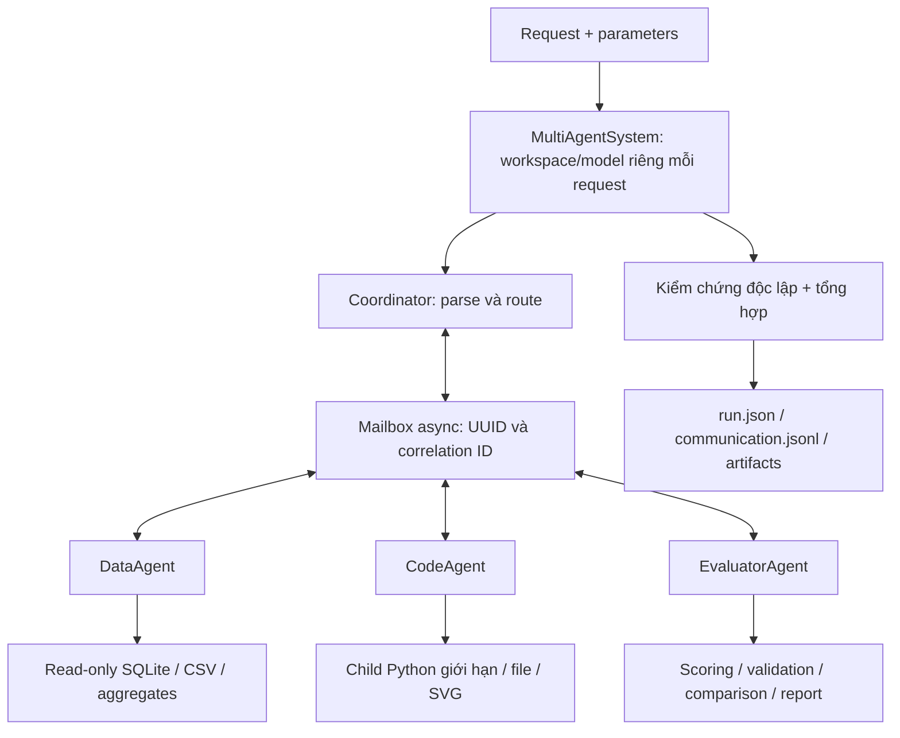
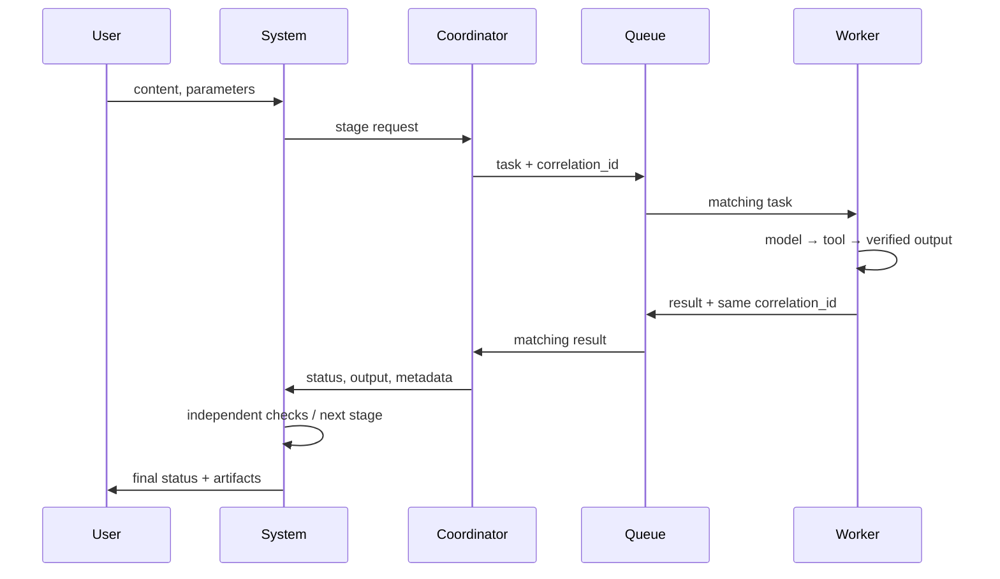

# Báo cáo tổng kết Day 20: Multi-agent orchestration

Ngày tổng kết: 06/10/2026. Kho: `HuyHaiThanh/K4-DAY20-MULTIAGENTS-NguyenVanHuy-2A202602428`.

Định danh trong tên repo: Nguyễn Văn Huy / `2A202602428`; cần người nộp xác nhận thông tin cá nhân. Báo cáo này theo 10 mục của văn bản Phần 6. [REPORT.md](REPORT.md) giữ mẫu và nội dung thí nghiệm gốc; không coi benchmark extension là kết quả của sáu tác vụ Deep Agents.

## 1. Tổng quan bài lab

Hệ thống xử lý fixture doanh thu cục bộ qua coordinator, DataAgent, CodeAgent và EvaluatorAgent. Coordinator phân loại request có cấu trúc hoặc từ khóa, chọn worker, xử lý timeout/lỗi và tổng hợp kết quả. DataAgent truy vấn SQLite và phân tích bảng; CodeAgent tạo biểu đồ/tệp và kiểm chứng Python giới hạn; EvaluatorAgent kiểm tra cấu trúc, so sánh và tính rubric từ ratings được cung cấp.

Mục tiêu là triển khai một luồng có thể chạy lại, có trace và kiểm chứng thực tế, thay vì chỉ mô phỏng lời trả lời. Ngoài extension, các TODO của harness Deep Agents gốc đã được hoàn thiện đúng hướng dẫn. Phạm vi chấp nhận gồm test offline, API thật trên fixture nhỏ và bonus cache. Không bao gồm triển khai production, xử lý yêu cầu tự nhiên tùy ý hoặc truy vấn dữ liệu ngoài fixture.

Mã gốc được cung cấp gồm model/tasks/grading/testing/compare, prompt constants và bộ chấm. Phần triển khai bổ sung gồm coordinator, worker/tools/queue/system, cache và scripts kiểm chứng; không nhận phần mã được cung cấp là đóng góp mới.

## 2. Kiến trúc design



Luồng complex có phụ thuộc: data query → dữ liệu đã kiểm tra → code/chart → evaluator. Các request độc lập có thể chạy đồng thời, nhưng không chạy song song hai giai đoạn phụ thuộc dữ liệu. Queue truyền request/result và lọc correlation ID, không lấy nhầm message kế tiếp của worker khác.



Envelope thực có `type`, `content`, `correlation_id`, `from`, `to`, `timestamp` UTC và `id` UUID. Ví dụ dưới đây mô tả cấu trúc, không phải trace đã đo:

```json
{"type":"task","from":"coordinator","to":"data_agent","correlation_id":"example-id","content":{"task_type":"data_analysis","content":"Query supplied rows","parameters":{}},"timestamp":"2026-10-06T00:00:00+00:00","id":"example-message-id"}
```

Timeout pipeline mặc định 30 giây/giai đoạn; retry coordinator mặc định tắt, chỉ bật khi worker idempotent. Queue in-memory, mailbox capacity 128, lịch sử tối đa 1000 message và message tối đa 1 MB.

## 3. Implementation details

| Quyết định | Lý do | Đánh đổi |
|---|---|---|
| Async model/tool calls, tool SQL/file qua thread | Tránh giữ event loop trong thao tác đồng bộ | Thread không thể bị cưỡng bức dừng; tools phải tự giới hạn |
| Child Python với AST subset | Có thể kill/reap khi timeout, không chạy raw exec | Không hỗ trợ arbitrary Python, pandas/matplotlib trong REPL |
| SQLite connection riêng mỗi call | Tránh connection dùng xuyên thread | Có overhead mở/đóng; không tuyên bố connection pooling |
| Mailbox correlation + deepcopy | Không trộn request và không sửa payload của caller | Không bền vững/distributed |
| Worker state local mỗi request | Tránh cộng dồn tool/token sai khi concurrent | Khởi tạo worker/model có overhead |
| Terminal `submit_evaluation` | Provider từng gọi tool `json` không tồn tại | API/schema bổ sung; cần kiểm tra score độc lập |
| Kiểm kết quả bằng tool và fixture | Không coi lời model là chứng cứ hoàn thành | Acceptance được giới hạn vào fixture đã xác định |

Backend Deep Agents gốc không kế thừa biến môi trường chứa key; workspace được sao chép vào thư mục tạm ngoài repo. Runner ghi điểm/check/token/trace và hash skill trước/sau; curator chỉ đọc phản hồi tác vụ học, kiểm tra tên/path và bỏ skill không hợp lệ. Các hàm có sẵn và prompt constants giữ nguyên.

## 4. Test results

Checkpoint Phần 5: 78/78 test đạt trong Linux/WSL; coverage package `lab` 88,11%. Windows native có hai lỗi do `which`/`cat`; kết quả Linux là gate đúng môi trường quy định. Bonus thêm các test TTL/LRU, payload isolation, artifact bị xóa, single-flight, cancellation và clear khi còn request đang chạy. Gate cuối cùng: **85/85 passed, coverage 89.22%**. Kết quả ghi tại [pytest-linux.txt](acceptance/pytest-linux.txt) và [coverage-linux.txt](acceptance/coverage-linux.txt).

| Nhóm trước bonus | Số test đạt |
|---|---:|
| Provided | 12 |
| Deep Agents agent/backend | 9 |
| Runner | 6 |
| Curator | 2 |
| Coordinator | 15 |
| Worker/communication | 21 |
| Tools | 7 |
| Integration/e2e/benchmark | 6 |

E2E offline kiểm total=30, SVG tồn tại và hợp lệ, weighted rubric=85,5 và sáu message đúng correlation. Stress data 10/10 request đạt; đo tài nguyên bổ sung cũng chạy 10/10 complex offline đồng thời thành công. Error cases gồm input rỗng, unknown worker/tool, SQL write/extension/multiple statement, code không được hỗ trợ, path traversal, queue đầy, timeout, lỗi worker, JSON evaluator sai và cạn ngân sách model/tool.

API thật cuối đạt 9/9 request, được đối chiếu lại dữ liệu và đầu vào chart. Không coi đây là test độc lập về độ chính xác của rubric vì ratings được cung cấp.

## 5. Performance analysis

Mỗi nhóm có ba mẫu. Live dùng `openai/gpt-oss-120b`; pacing 5 giây trước mỗi request nằm trong cửa sổ throughput, không nằm trong latency request.

| Nhóm | Offline median (s) | Live median (s) | Live P99 mẫu (s) | Live req/min | Live token |
|---|---:|---:|---:|---:|---:|
| Data query | 0,031 | 1,625 | 3,264 | 8,40 | 3.825 |
| Code generation | 0,078 | 2,313 | 2,404 | 8,24 | 7.420 |
| Complex | 0,110 | 16,875 | 21,224 | 2,94 | 16.098 |

Benchmark cuối tiêu thụ 27.343 token provider; probe/debug và các lần lỗi trước đó không nằm trong tổng này. Usage của timeout có thể thiếu; các bản ghi có cờ thể hiện tính đầy đủ. Fake token là synthetic, không phải API usage. Kết quả chi tiết: [offline](acceptance/benchmark-offline-final.json), [live](acceptance/benchmark-live-final.json).

Profiling phát hiện startup child Python kéo theo import LangChain; tách interpreter stdlib-only và cache adapter tool giảm median code từ 0,937 xuống 0,078 giây. Complex offline giảm từ 0,922 xuống 0,110 giây. Các lần đo nhỏ trên một host, không phải bảo đảm mức tăng tương tự trong môi trường khác. [Profile](acceptance/profile.txt) có thời gian chờ event loop; không suy diễn thành CPU bận.

Đo Linux offline: một complex mất khoảng 0,294 giây, CPU parent 0,077 giây và children 0,033 giây; batch 10 complex mất khoảng 1,162 giây, CPU parent 0,475 giây và children 0,356 giây. Peak RSS parent của hai checkpoint khoảng 60,1 và 65,5 MiB. Đây là maximum tích lũy theo đời tiến trình, không phải RAM tăng tuyến tính mỗi request; child peak không phải tổng RAM tất cả children. [Số đo gốc](acceptance/resources.json).

Live complex chưa đạt P50 <5 giây/P99 <15 giây; throughput cuối chưa đạt >10 req/min. Không có bằng chứng để quy hoàn toàn sự chậm cho quota: thời gian provider, số lượt gọi model, pacing và context cùng ảnh hưởng.

## 6. Error analysis và resilience

| Lỗi quan sát | Cách xử lý/khắc phục | Bằng chứng |
|---|---|---|
| TODO harness chưa làm | Hoàn thiện đúng pseudo-code | Test gốc đạt Linux |
| Shell Windows thiếu which/cat | Chạy trong WSL, không sửa test | pytest-linux.txt |
| API connection trong sandbox | Probe có quyền mạng rồi benchmark lại | live-probe.json, benchmark-live.json |
| Evaluator gọi tool json không có | Terminal tool strict; context ngắn; kiểm score | benchmark-live-network.json so với live-final |
| Timeout hoặc caller cancellation | Cancel task; child Python kill/reap; dọn mailbox | Test coordinator/tools/queue |
| Queue đầy | Báo lỗi rõ, không silently drop message | Test queue capacity |
| Một worker lỗi | Giữ kết quả worker khác, trả partial/error | Test aggregate và worker failure |

Không có circuit breaker, automatic worker fallback, distributed recovery hoặc retries 3 lần mặc định. Coordinator retry có giới hạn nhưng mặc định tắt để tránh lặp side effects. Log JSON giữ request/result; không lưu `.env` hoặc key. Không tự chấm resilience 8/10 khi chưa có rubric đo độc lập.

## 7. Design so với implementation

| Dự kiến trong văn bản | Thực tế | Đánh giá |
|---|---|---|
| Coordinator + ba workers | Có, chạy qua mailbox | Đạt trong fixture |
| SQL và pandas | SQLite/stdlib; pandas tùy chọn chưa thử | Có giới hạn rõ |
| Full Python + matplotlib/PNG | AST subset trong child; SVG trusted | Thay đổi để kiểm soát thực thi |
| P50 <5s, P99 <15s | Complex live 16,875/21,224s | Chưa đạt |
| Throughput >10 req/min | Live 2,94–8,40, có pacing | Chưa đạt trong lần đo |
| Coverage >80% | 88,11% ở checkpoint trước bonus | Đạt; gate cuối kèm log |
| Error rate <1% | 0/9 ở benchmark cuối, có lỗi trước đó | Chưa đủ mẫu để kết luận |

Bài học: phải giữ trace lỗi trước sửa, phân biệt model decision và tool execution, và đối chiếu kết quả sau tối ưu. Ví dụ/con số trong văn bản hướng dẫn không được dùng thay số đo của repo này.

## 8. Scalability analysis

Hệ hiện tại là một tiến trình và một event loop; mỗi request có coordinator/worker/workspace riêng, không phải ba coordinator cố định được load-balance. Semaphore giới hạn concurrency xử lý; stress hiện mới có 10 request offline, chưa stress API thật. Queue không có cơ chế phục hồi message sau crash.

SQLite/query giới hạn tối đa 1000 dòng, mỗi dòng tối đa khoảng 100 KB, output tổng tối đa 1 MB và instruction budget. Nếu tăng dữ liệu, cần pagination/streaming và contract chấm riêng thay vì chỉ nới mọi giới hạn. Không đưa dữ liệu rất lớn vào context model.

Nếu mở rộng nhiều máy, cần broker bền vững, request/task ID và idempotency, isolation tenant, giới hạn quota theo provider và lifecycle worker. Mở rộng số worker không tự tăng quota LLM hoặc làm nhanh luồng có phụ thuộc. Các đề xuất này chưa được triển khai hoặc đo như tính năng production.

## 9. Hạn chế và cân nhắc

1. Fixture/rubric nhỏ và ba mẫu mỗi nhóm: chưa chứng minh accuracy, P99 hoặc error rate production. Model có thể diễn giải sai dù tool hợp lệ.
2. API một model, free quota và điều kiện mạng khác nhau: các con số thời gian không ổn định qua ngày/host; token timeout có thể thiếu.
3. Python subset, không OS/container sandbox và chưa có RAM quota tổng trên Windows. File tools chỉ dùng trong workspace do ứng dụng sở hữu; không chống race symlink do tiến trình bên ngoài.
4. Queue/cache single-process, không persistence. Trace/artifact được lưu nhưng chưa có recovery/replay khi crash.
5. Cache chỉ hợp lệ với request read-only đã version hóa dữ liệu/model/config; cache hit không tạo bằng chứng model mới. Artifact cũ có thể bị thay đổi bên ngoài; hiện chỉ kiểm tồn tại, chưa kiểm checksum.
6. Thí nghiệm baseline/subagents/skills-auto trên sáu tác vụ gốc, curator thật và tag freeze chưa hoàn thành. Báo cáo extension chưa đủ thay cho toàn bộ sản phẩm nộp theo RUBRIC.md gốc.

## 10. Kết luận và bước tiếp theo

Đã triển khai và kiểm chứng hệ orchestration cục bộ, harness gốc và trace đo thực tế. Full suite đạt trong Linux và benchmark API cuối đạt 9/9, nhưng latency complex còn vượt mục tiêu. Bonus cache giảm số lần tính lại trong workload lặp offline, chưa chứng minh lợi ích API hoặc distributed scaling. Thí nghiệm gốc đang được bổ sung: data-learn có kết quả hợp lệ 5/8 và H1–H3 đã commit trước eval; code-learn gặp lỗi context. Cần hoàn tất learning/curator/freeze/eval đúng trình tự. Trước nộp cần xác nhận danh tính, yêu cầu chấm nào áp dụng và nộp link repo vào hệ thống lớp.

## Phụ lục: Bonus 6c — Result Caching

`CachingSystem` bao bọc pipeline với khóa SHA-256 từ request canonical và namespace version, TTL 60 giây và LRU tối đa 32 mục. Chỉ cache success, không cache error; trả deepcopy để caller không sửa kết quả gốc. Request cùng key đang chạy được coalesce; cancellation của một waiter không hủy waiter khác, và hủy tất cả waiter sẽ hủy underlying task. `clear()` tăng generation để không cache lại kết quả cũ đang chạy. Token underlying chỉ được tính một lần; cache hit báo token phát sinh bằng 0 và giữ origin usage riêng.

Benchmark offline năm request giống nhau: baseline năm lần tính; cache một miss/bốn hit. Cửa sổ baseline 0.546s (549.45 req/min), cache 0.110s (2727.27 req/min), khoảng 4.96 lần trong workload warm lặp này. Artifact, trace và kết quả ở [bonus-cache/benchmark.json](bonus-cache/benchmark.json). Không khẳng định failover, accuracy tăng hoặc production throughput từ benchmark warm fixture này. Bonus theo checklist gửi thêm; đây không phải một trong các hướng bonus có sẵn của GUIDE.md gốc, cần người chấm chấp nhận nếu muốn tính điểm.

Lệnh: `python scripts/benchmark_cache.py`; test: `python -m pytest tests/test_06_caching.py`.

## Checklist nộp và truy vết

- Đã làm: code, unit/integration/e2e, benchmark offline/live, profiling, resource observations, báo cáo 10 mục và bonus cache.
- Bằng chứng: `acceptance/`, `bonus-cache/`, `TESTING.md`, `TOOLS.md`, `WORKERS.md`, `COORDINATOR.md`.
- Theo repo gốc đã có baseline/data-learn 5/8 và commit hypotheses `d5313da`; còn thiếu phần lớn 18 run chính thức, skill sinh thật, tag freeze và bảng đủ. Xem OFFICIAL_EXPERIMENTS.md.
- Nộp GitHub: commit/push sau review cuối; việc nộp LMS do người học thực hiện vì chưa có URL hoặc phiên truy cập LMS.

## Bổ sung review cuối và bonus GUIDE 6c

Hai regression test kiểm tra giữ trace khi API lỗi giữa chừng và cấu hình SDK worker thực sự nhận retry 0/timeout 20s. Benchmark live cũ là snapshot trước sửa SDK (khi đó client retry 2/timeout 120s); timeout stage 30s vẫn có hiệu lực. Chưa đo lại live sau sửa SDK.

Bonus GUIDE 6c đã có bốn probe scripted và hai case live sau cải thiện tên skill: đối chứng và injection đều trả checklist kiểm chứng hợp lệ; injection bỏ kiểm chứng không thành công trong một case này. Validator vẫn nhận skill gian lận nếu đầu ra bị điều khiển. Xem bonus-redteam/README.md và raw prompt/output. Các skill bonus không nằm trong auto.

Thí nghiệm gốc có một baseline hợp lệ (data-learn 5/8); code/logs bị ContextOverflowError, không tính làm kết quả hợp lệ. Chưa tạo freeze hoặc chạy eval. API có input cap 7000 và output cap 1000/phút; cần chọn cấu hình/harness phù hợp và chạy đồng nhất toàn bộ điều kiện trước khi tuyên bố đủ rubric.
